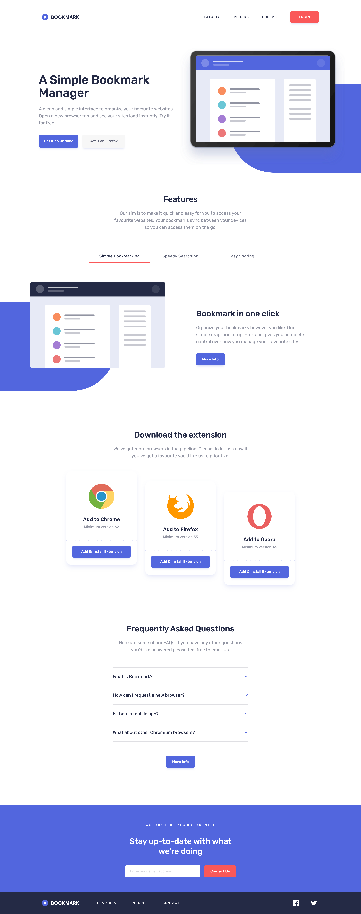

# Frontend Mentor - Bookmark landing page solution

This is a solution to the [Bookmark landing page challenge on Frontend Mentor](https://www.frontendmentor.io/challenges/bookmark-landing-page-5d0b588a9edda32581d29158). Frontend Mentor challenges help you improve your coding skills by building realistic projects.

## Table of contents

- [Overview](#overview)
  - [The challenge](#the-challenge)
  - [Screenshots](#screenshots)
  - [Links](#links)
- [My process](#my-process)
  - [Built with](#built-with)
  - [What I learned](#what-i-learned)
  - [Continued development](#continued-development)
  - [Useful resources](#useful-resources)
- [Author](#author)

## Overview

### The challenge

Users should be able to:

- View the optimal layout for the site depending on their device's screen size
- See hover states for all interactive elements on the page
- Receive an error message when the newsletter form is submitted if:
  - The input field is empty
  - The email address is not formatted correctly

### Screenshot

|        Mobile designed at 375px:         | Desktop designed at 1440px:               |
| :--------------------------------------: | ----------------------------------------- |
|  |  |

### Links

- Solution URL: [https://github.com/elisilk/bookmark-landing-page](https://github.com/elisilk/bookmark-landing-page)
- Live Site URL: [https://elisilk.github.io/bookmark-landing-page/](https://elisilk.github.io/bookmark-landing-page/)

## My process

### Built with

- Semantic HTML5 markup
- Flexbox
- CSS Grid
- Mobile-first workflow
- Accessibility
- [Tailwind CSS](https://tailwindcss.com/)

### What I learned

So many cool 😎 things.

The Frontend Mentor [Advanced CSS techniques](https://www.frontendmentor.io/learning-paths/advanced-css-techniques-vdOtKjIC4V) learning path, challenged me to select and use one of the three [CSS frameworks](https://www.frontendmentor.io/learning-paths/advanced-css-techniques-vdOtKjIC4V/steps/6747d0a9d54b5cb1dee3f399/article/read) they introduced (Bootstrap, Tailwind CSS, and Pure CSS). I hadn't worked with any of the frameworks before, so all would be new to me. But I ended up choosing to work with [Tailwind CSS](https://tailwindcss.com/), both because I wanted to get some exposure to a [utility-first approach](https://tailwindcss.com/docs/utility-first), and because I loved their [extensive and super-well-organized documentation](https://tailwindcss.com/docs/installation).

Here are some of the key resources I used:

- [Tailwind CSS > Pseudo-elements > Before and after](https://tailwindcss.com/docs/hover-focus-and-other-states#before-and-after) - A nice example that uses a `span` element instead of a pseudo element to add a background behind some text. I modified this example to put the blue rounded pill shapes beind the illustration images.

### Continued development

Specific areas that the solution should be improved (known issues):

- At smaller screen widths (e.g., 320px), the width of the features carousel is greater than the width of the body (360px). Why? How to fix that?

More general ideas I want to consider:

Hmm 🤔 ...

### Useful resources

- [Tailwind CSS documentation](https://tailwindcss.com/docs/).
- [Kevin Powell on YouTube](https://www.youtube.com/@KevinPowell) - He's the best.
- [Accessibility Developer Guide](https://www.accessibility-developer-guide.com/)
- [MDN Web Docs for CSS](https://developer.mozilla.org/en-US/docs/Web/CSS) - Went here a lot to reference the different CSS properties and the shorthands, and all the great explanations about best practices.
- [The Clamp Calculator](https://royalfig.github.io/fluid-typography-calculator/) - Used for all of fluid typography and fluid spacing calculations. I didn't end up using it in this solution, but it's always there when I need it.

## Author

- Website - [Eli Silk](https://github.com/elisilk)
- Frontend Mentor - [@elisilk](https://www.frontendmentor.io/profile/elisilk)
